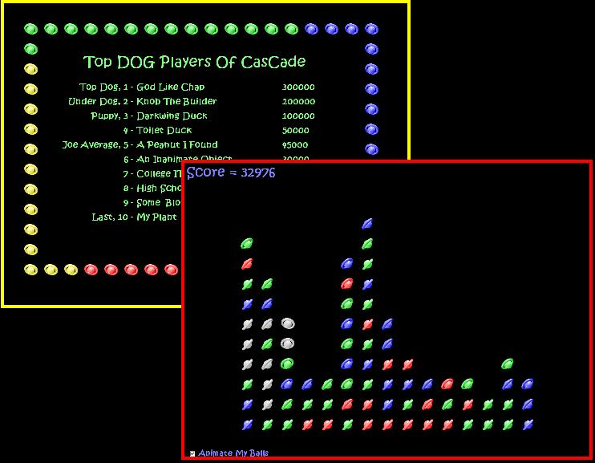



## Classic Game Cascade

### Description

It's been a while since my last post, but here's the classic game Cascade. I used to play this on an old Psion revo, and decided to make it for myself. How to play the game is in the program. I hope you enjoy it
 
### More Info
 
Can be strangely addictive if competeing against beloved ones??!!??

             |
---                |---
**Submitted On**   |2005-11-27 22:58:14
**By**             |[Steven Atkiss](https://github.com/Planet-Source-Code/PSCIndex/blob/master/ByAuthor/steven-atkiss.md)
**Level**          |Intermediate
**User Rating**    |5.0 (30 globes from 6 users)
**Compatibility**  |VB 5\.0, VB 6\.0
**Category**       |[Games](https://github.com/Planet-Source-Code/PSCIndex/blob/master/ByCategory/games__1-38.md)
**World**          |[Visual Basic](https://github.com/Planet-Source-Code/PSCIndex/blob/master/ByWorld/visual-basic.md)
**Archive File**   |[Classic\_Ga19517811282005\.zip](https://github.com/Planet-Source-Code/steven-atkiss-classic-game-cascade__1-63401/archive/master.zip)

